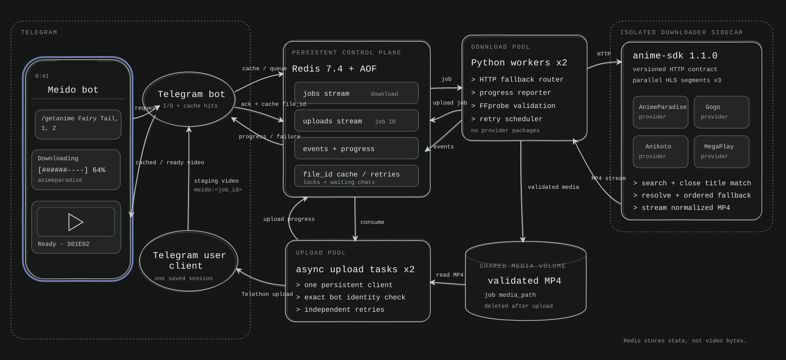

# Meido

<p align="center">
  
</p>

Meido is a Telegram bot that queues anime episode requests, prepares media in a
background worker, and caches Telegram `file_id` values in persistent Redis.

## Architecture



- The bot never performs downloads in its polling process.
- Redis stores cached episodes, persistent jobs, locks, and waiting users.
- Duplicate requests share one job.
- Download workers use replaceable HTTP adapters with ordered fallback.
- A separate uploader owns one persistent Telethon session.
- Download jobs, HLS segments, and episode uploads use bounded concurrency.
- Provider dependencies live in a pinned Node sidecar, not the Python worker.
- Media is streamed from the sidecar and validated by the worker with FFprobe.
- All services read one root `.env` file.

## Requirements

- Docker Desktop with Docker Compose
- A Telegram bot token from BotFather
- A Telegram user account and API credentials from `my.telegram.org`

The host does not need Python, Redis, a downloader runtime, or FFmpeg when
using Docker.

## Configuration

Copy the example and fill every Telegram value:

```bash
cp .env.example .env
```

```dotenv
TELEGRAM_BOT_TOKEN=
TELEGRAM_AGENT_USER_ID=
TELEGRAM_API_ID=
TELEGRAM_API_HASH=
TELEGRAM_PHONE=
TELEGRAM_BOT_USERNAME=
TELEGRAM_SESSION_NAME=meido_agent

REDIS_URL=redis://localhost:6379/0
DOWNLOAD_ROOT=downloads
DOWNLOADER_ENDPOINTS=animeparadise=http://downloader-anime-sdk:8080,gogoanime=http://downloader-anime-sdk:8080,anikoto=http://downloader-anime-sdk:8080,megaplay=http://downloader-anime-sdk:8080
DOWNLOADER_TIMEOUT_SECONDS=1800
DOWNLOADER_COOLDOWN_SECONDS=300
DOWNLOAD_CONCURRENCY=2
DOWNLOADER_MAX_JOB_ATTEMPTS=3
DOWNLOADER_RETRY_DELAY_SECONDS=60
UPLOAD_CONCURRENCY=2
UPLOAD_MAX_JOB_ATTEMPTS=3
UPLOAD_RETRY_DELAY_SECONDS=60
ANIME_SDK_PROVIDERS=animeparadise,gogoanime,anikoto,megaplay
ANIME_SDK_SEGMENT_CONCURRENCY=3
LOG_LEVEL=INFO
```

`TELEGRAM_AGENT_USER_ID` must be the numeric ID of the same personal Telegram
account configured by `TELEGRAM_PHONE`.
`TELEGRAM_BOT_USERNAME` must be the bot's username from BotFather, not the
personal account's username. The uploader resolves this peer at startup and
refuses to run if it is not a bot.

The `.env` file and Telethon session files are ignored by Git.

`DOWNLOADER_ENDPOINTS` is the ordered fallback list. Each entry maps a backend
name to a versioned HTTP sidecar. `ANIME_SDK_PROVIDERS` controls which provider
names that sidecar accepts. The worker receives only HTTP endpoints; it does not
install or import scraper packages.

## Run

Build the reproducible images:

```bash
docker compose build
```

Start Redis and authorize the uploader's Telegram account:

```bash
docker compose up -d redis
docker compose run --rm uploader python -m uploaderService.main --authorize
```

The authorization command asks for the Telegram login code and saves its
session in the persistent `telegram-sessions` volume. Then start the complete
stack:

```bash
docker compose up -d
docker compose logs -f bot worker uploader
```

Useful commands:

```bash
docker compose ps
docker compose logs --tail=100 bot worker uploader downloader-anime-sdk redis
docker compose down
```

Validate the configured downloader directly, without Redis, Telegram, or the
bot:

```bash
docker compose run --rm --no-deps worker \
  python -m downloaderService.smoke_test "Death Note" 3 \
  --season 1 --backend animeparadise
```

The smoke command downloads and validates a ten-second MP4 sample. Repeat it
with each configured backend, or add `--full` for a complete episode. Only
retry `/getanime` after at least one direct smoke test succeeds.

The conservative local defaults are two episode downloads, two episode
uploads, and three HLS segment requests per active download. Reduce the three
concurrency settings to `1` on a slow connection or when a provider starts
rate-limiting.

`docker compose down` keeps persistent volumes. Use `docker compose down -v`
only when you intentionally want to delete Redis data and Telegram sessions.

## Bot commands

- `/start` — confirm the bot is online.
- `/help` — show command usage.
- `/getanime <name>, <season>, <episode>` — return a cached episode or queue
  one worker job.

Example:

```text
/getanime Death Note, 1, 3
```

## Local development

Create a bot/test environment:

```bash
python -m venv .venv
.venv/Scripts/python -m pip install -r requirements-test.txt
.venv/Scripts/python -m pytest
```

The worker dependencies intentionally live in `requirements-worker.txt`.
Downloader dependencies stay out of the Telegram bot process.

## Persistence

Redis runs with:

```text
appendonly yes
appendfsync everysec
```

Its AOF data, downloaded media, and Telethon sessions use named Docker volumes.
Cached Telegram file IDs can therefore survive service and machine restarts.

## Security

- Never commit `.env` or `*.session`.
- Rotate a bot token immediately if it appears in logs.
- HTTP client request logging is suppressed because Telegram API URLs contain
  the bot token.
- Keep the Redis port private when deploying outside a development machine.

## Legal

This project is for educational use. Operators are responsible for complying
with copyright law and the terms of every content provider and Telegram.
